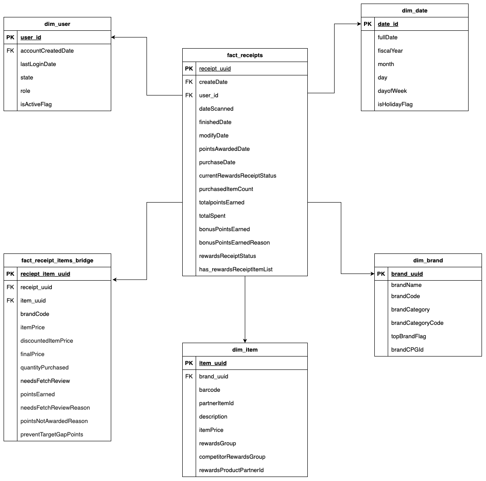

# Fetch Rewards - Analytics Engineer

This repository contains the take-home assignment for the Analytics Engineer role at Fetch Rewards. It includes data analysis, SQL queries, and insights derived from Fetch Rewards' dataset.  

Fetch Rewards is a receipt-scanning rewards platform that allows consumers to earn points for purchasing products from partnered brands. This analysis focuses on evaluating data quality, identifying key issues, and proposing improvements to enhance data integrity and reporting.  

## Data Model  

Below is the data model used in this analysis:  

 

The dataset includes key entities such as:  
- **Users (`dim_user`)**: Captures user information and account activity.  
- **Brands (`dim_brand`)**: Stores details about brands, including category and partnerships.  
- **Items (`dim_item`)**: Contains purchased item details such as barcode, brand, and quantity.  
- **Receipts (`fact_receipts`)**: Records transaction-level data from scanned receipts.  
- **Receipt-Item Bridge (`fact_receipt_items_bridge`)**: Connects receipts with purchased items.  

---

## Documentation  

### 📌 [Data Model Diagram](data_model/data_model.png)  
Contains a detailed breakdown of the database schema along with an embedded image of the model.  

### 📌 [SQL Analysis Script](sql/queries.sql)  

### 📌 [Exploratory Data Analysis (EDA) Notebook](notebooks/fetch_eda.ipynb)  
An interactive Jupyter Notebook exploring the dataset, highlighting trends, and visualizing key insights.  

### 📌 [Stakeholder Summary](question4_stakeholderSummary.html)
A high-level document outlining the **main data issues** and **proposed improvements** for business stakeholders.  

### 📌 [Project Brief](documents/fetch_dataQaulityIssues_brief.pdf)  
A concise summary designed for stakeholders, explaining the project's scope, objectives, and design approach.  

### 📌 [Deep Dive: Data Issues & Recommended Fixes](documents/fetch_dataQualityIsuues_deepDive.html)  
A detailed document covering all identified **data integrity issues** and potential **fixes**.  

---

## Data Integrity Issues

### Revenue & Consumer Impacting Issues (High Priority)
*Issues that directly affect revenue, consumer experience, and brand partnerships.*

- **Barcode & Brand Code Mismatches**  
  Missing or incorrect barcodes prevent **proper item recognition**, leading to incorrect or missing rewards for consumers.  
  Brands may not receive proper attribution, affecting partnerships and revenue-sharing agreements.  

- **Rejected Receipts Still Earning Points**  
  Cases where receipts marked as "rejected" still have **non-zero points awarded**.  
  Creates potential **fraud risk**, financial loss, and inconsistent consumer experience.  

- **Duplicate User Entries (OID Duplication)**  
  Multiple entries for the same user (OID) with identical creation and login dates.  
  Causes **over-counting of active users**, impacting revenue reporting and marketing insights.  

- **Significant Missing Values in Critical Transaction Fields**  
  `purchasedItemCount` is missing in some rows where `totalSpent` is present.  
  Impacts revenue calculations and consumer insights on spending behavior.  

- **Brand & Category Code Standardization Issues**  
  Many brand codes and category codes are **“NA”** or duplicated from `brandName`.  
  Leads to **incorrect brand-level performance tracking**, affecting partner relationships.  

---

### Operational & Analytical Integrity Issues (Medium Priority)
*Issues that affect data consistency, analytics accuracy, and business intelligence but don’t immediately disrupt revenue or consumer experience.*

- **Invalid Receipt Status Overwriting (Lack of Change Tracking)**  
  Receipt statuses are overwritten instead of tracked historically.  
  Reduces visibility into processing bottlenecks, fraud detection, and dispute resolution.  

- **SignUp Source Data Gaps**  
  48 records have `None` values for `signUpSource`, leading to inaccurate **marketing attribution**.  
  Makes it difficult to optimize acquisition strategies.  

- **Test Brand Entries in Dataset**  
  Placeholder brands such as **@test_brand** should be removed from business-facing reports.  
  Impacts the accuracy of **brand-level performance insights**.  

---

### Minor Data Quality & Enhancements (Low Priority)
*Issues that don’t immediately impact operations but could improve reporting and efficiency if addressed.*

- **Items Missing Key Identifiers**  
  `barcode`, `brandCode`, and `itemNumber` missing in thousands of rows.  
  Instead of recording a higher quantity for the same item, **multiple line items are created**, leading to redundancy.  

- **Time-Based Enhancements for Deeper Analysis**  
  No tracking of **rush hour transactions** or **event-based trends**.  
  Could be useful for **promotional targeting and campaign performance tracking**.  

---

## How to Use This Repository  
1. Clone the repository:
   ```sh
   git clone https://github.com/gshruti015/fetch